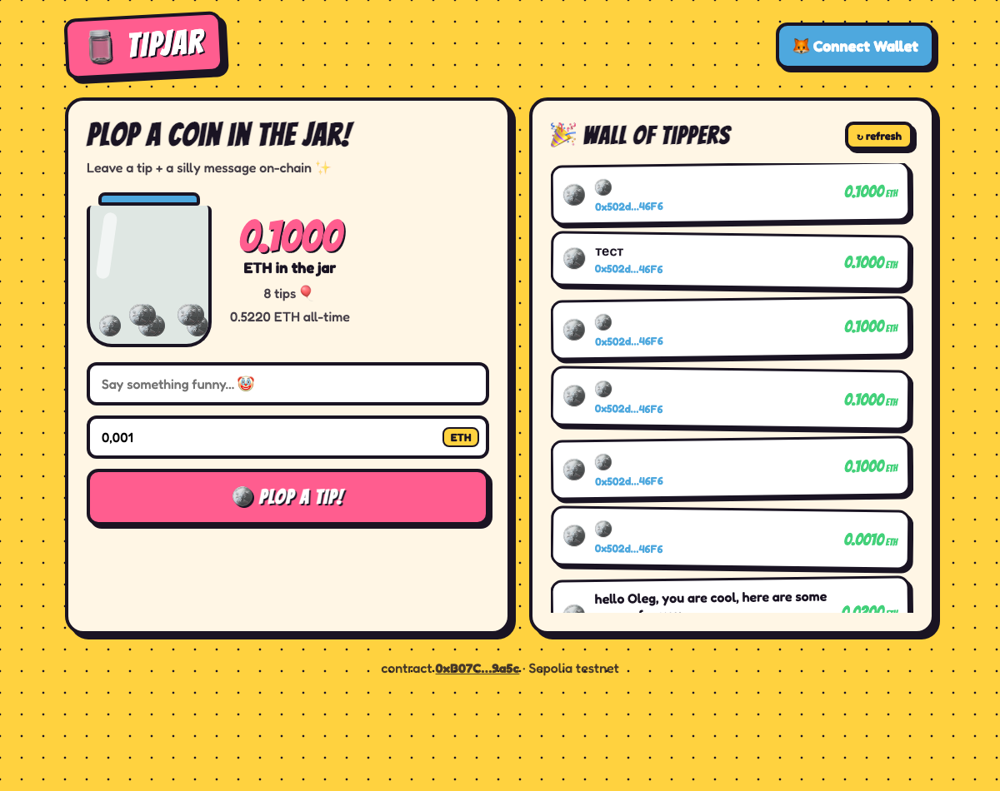

# TipJar

A simple on-chain tip jar: anyone can leave a tip with a message, only the owner can withdraw.

## Deployments

| Network | Address | Explorer |
|---------|---------|----------|
| Sepolia | `0xB07C55a05510B1585DB53847F47537570ee69a5c` | [Etherscan](https://sepolia.etherscan.io/address/0xB07C55a05510B1585DB53847F47537570ee69a5c) |

## Frontend

A React + web3.js dApp with a cartoony comic UI lives in [`frontend/`](frontend/).



**Features**
- 🦊 Connect MetaMask, auto-detects the network and offers to switch to Sepolia
- 🪙 Leave a tip with a message (`addTip`)
- 🫙 Jar shows the **real contract balance** (what's actually withdrawable), plus the all-time total
- 🎉 Live "Wall of Tippers" feed from `getTips()` (auto-refreshes)
- 💰 Owner-only **Cash out** button (`withdraw`)

**Run it locally**

```shell
$ cd frontend
$ npm install
$ npm run dev
```

> Reads go through a CORS-friendly public RPC (`ethereum-sepolia-rpc.publicnode.com`);
> transactions are signed and broadcast by MetaMask. The contract address, ABI and
> network live in [`frontend/src/config.js`](frontend/src/config.js).

## Foundry

**Foundry is a blazing fast, portable and modular toolkit for Ethereum application development written in Rust.**

Foundry consists of:

- **Forge**: Ethereum testing framework (like Truffle, Hardhat and DappTools).
- **Cast**: Swiss army knife for interacting with EVM smart contracts, sending transactions and getting chain data.
- **Anvil**: Local Ethereum node, akin to Ganache, Hardhat Network.
- **Chisel**: Fast, utilitarian, and verbose solidity REPL.

## Documentation

https://book.getfoundry.sh/

## Usage

### Build

```shell
$ forge build
```

### Test

```shell
$ forge test
```

### Format

```shell
$ forge fmt
```

### Gas Snapshots

```shell
$ forge snapshot
```

### Anvil

```shell
$ anvil
```

### Deploy

```shell
$ source .env
$ forge script script/TipJar.s.sol:TipJarScript \
    --rpc-url sepolia \
    --account deployer \
    --broadcast \
    --verify
```

### Cast

```shell
$ cast <subcommand>
```

### Help

```shell
$ forge --help
$ anvil --help
$ cast --help
```
